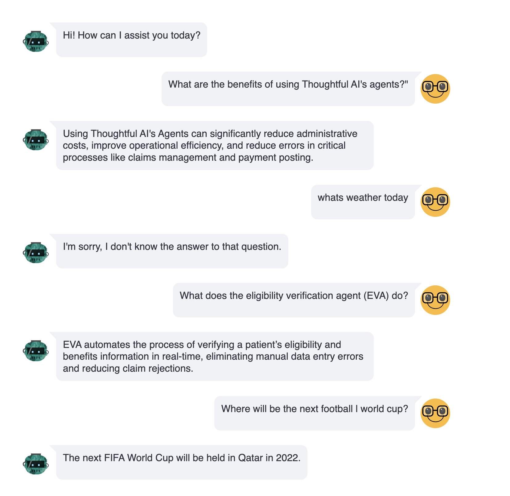

# LLM RAG

A simple customer support AI Agent to assist users with basic questions about Thoughtful AI


## Features

- The agent accepts user input and answer the question like a conversational AI Agent.
- It retrieves the most relevant answer from a hardcoded set of responses about Thoughtful AI.
- And finally display the answer to the user in a user-friendly format.


## API Reference

#### Post Query to get response from the PDF data
#### Delete the Vector Stores from the memory against the UUID


#### Post the query and relative uuid in header

```http
  POST /query/
```

| Parameter | Type     | Description                       |
| :-------- | :------- | :-------------------------------- |
| `query`      | `String` | **Required**. Query from User|


## Environment Variables

To run this project, you will need to add the following environment variable to your .env file

`openai_api_key`


## Run Locally

#### Backend Setup

Clone the project

```bash
 https://github.com/rizwansaleem01/thoughful_AI_bot
```

Go to the project directory

```bash
  cd thoughtful_AI_bot
```

Install dependencies

```bash
  pip install -r requirements.txt
```

Start the server

```bash
  uvicorn main:app --host 0.0.0.0 --port 8000
```

Go to the frontend directory

```bash
  cd streamlit_frontend
```

Install dependencies

```bash
  pip install -r requirements.txt
```

Start the server

```bash
  streamlit run streamlit_app.py
```


## Run with Docker Compose

Install dependencies

```bash
  docker-compose up
```

Some sample images:


